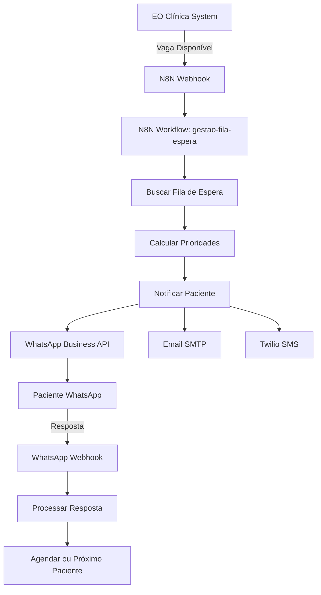

# 📱 Integração N8N + WhatsApp - EO Clínica

## 📋 Visão Geral

Esta documentação descreve a integração completa entre o sistema EO Clínica, N8N (automação de workflows) e WhatsApp Business API para automatização de notificações de fila de espera e agendamentos.

## 🔄 Arquitetura da Integração



## 🚀 Fluxo Completo de Integração

### 1. Trigger de Vaga Disponível

Quando uma vaga fica disponível no sistema EO Clínica:

```javascript
// Evento disparado no sistema
const vagaDisponivel = {
  specialtyId: "spec_101",
  specialtyName: "Cardiologia",
  doctorId: "doc_789", 
  doctorName: "Dr. João Silva",
  availableDate: "2024-12-15T14:00:00.000Z",
  duration: 30,
  reason: "cancellation"
};

// Webhook para N8N
fetch('https://n8n.eo-clinica.com/webhook/vaga-disponivel', {
  method: 'POST',
  headers: {
    'Content-Type': 'application/json',
    'X-N8N-Webhook-Secret': process.env.N8N_WEBHOOK_SECRET
  },
  body: JSON.stringify(vagaDisponivel)
});
```

### 2. Processamento N8N

O workflow `gestao-fila-espera.json` processa a vaga:

#### 2.1 Validação de Dados
```javascript
// Node: Validar Dados
const requiredFields = ['specialtyId', 'date', 'duration'];
const missingFields = [];

for (const field of requiredFields) {
  if (!$input.first().json[field]) {
    missingFields.push(field);
  }
}

if (missingFields.length > 0) {
  throw new Error(`Campos obrigatórios ausentes: ${missingFields.join(', ')}`);
}

// Validar se data não é no passado
const availableDate = new Date($input.first().json.date);
const oneHourFromNow = new Date(Date.now() + (60 * 60 * 1000));
if (availableDate < oneHourFromNow) {
  throw new Error('Vaga muito próxima - mínimo 1 hora de antecedência necessária');
}
```

#### 2.2 Buscar Fila de Espera
```javascript
// Custom Node: EO Clínica API
const response = await fetch(`${process.env.API_BASE_URL}/api/n8n/queue/specialty/${specialtyId}`, {
  headers: {
    'Authorization': `Bearer ${process.env.N8N_API_KEY}`
  }
});

const queueData = await response.json();
```

#### 2.3 Algoritmo de Priorização
```javascript
// Node: Ordenar por Prioridade
const queueData = $json.data || [];

const scoredQueue = queueData.map(patient => {
  const waitingTime = Date.now() - new Date(patient.queuedAt).getTime();
  const waitingDays = waitingTime / (1000 * 60 * 60 * 24);
  
  // Scores base por prioridade
  const priorityScores = {
    'EMERGENCY': 1000,
    'HIGH': 100,
    'MEDIUM': 50,
    'LOW': 10
  };
  
  let score = priorityScores[patient.priority] || 10;
  score += waitingDays; // Bonus por tempo de espera
  
  if (patient.age >= 65) score += 20; // Bonus idosos
  if (patient.specialNeeds) score += 15; // Necessidades especiais
  if (patient.previousCancellations > 0) score += (patient.previousCancellations * 5);
  if (patient.noShowCount > 0) score -= (patient.noShowCount * 10);
  
  return { ...patient, priorityScore: Math.max(score, 0) };
});

// Ordenar por score e filtrar elegíveis para notificação
const sortedQueue = scoredQueue.sort((a, b) => b.priorityScore - a.priorityScore);
```

### 3. Notificação WhatsApp

#### 3.1 Envio de Template WhatsApp
```javascript
// Node: WhatsApp Vaga Disponível
const whatsappPayload = {
  "messaging_product": "whatsapp",
  "to": patient.phone,
  "type": "template",
  "template": {
    "name": "vaga_disponivel",
    "language": { "code": "pt_BR" },
    "components": [
      {
        "type": "body",
        "parameters": [
          { "type": "text", "text": patient.name },
          { "type": "text", "text": slot.specialtyName },
          { "type": "text", "text": `Dr(a) ${slot.doctorName}` },
          { "type": "text", "text": new Date(slot.date).toLocaleDateString('pt-BR') },
          { "type": "text", "text": new Date(slot.date).toLocaleTimeString('pt-BR') },
          { "type": "text", "text": Math.floor(patient.waitingDays).toString() }
        ]
      },
      {
        "type": "button",
        "sub_type": "url",
        "index": "0",
        "parameters": [
          { "type": "text", "text": notificationId }
        ]
      }
    ]
  }
};

// Envio via WhatsApp Business API
await fetch(`https://graph.facebook.com/v17.0/${process.env.WHATSAPP_PHONE_NUMBER_ID}/messages`, {
  method: 'POST',
  headers: {
    'Authorization': `Bearer ${process.env.WHATSAPP_ACCESS_TOKEN}`,
    'Content-Type': 'application/json'
  },
  body: JSON.stringify(whatsappPayload)
});
```

#### 3.2 Template WhatsApp `vaga_disponivel`

```
🎉 *VAGA DISPONÍVEL!*

Olá {{1}}, liberou vaga para:

📋 *Especialidade:* {{2}}
👨‍⚕️ *Médico:* {{3}}
📅 *Data:* {{4}}
🕐 *Horário:* {{5}}

⏰ *RESPONDA EM 2 HORAS!*

📊 Você estava na fila há {{6}} dias
🏥 EO Clínica - Sistema de Agendamento
```

**Botões do Template:**
- ✅ **ACEITAR VAGA** (URL: `{{aceitar_url}}`)
- ❌ **RECUSAR VAGA** (URL: `{{recusar_url}}`)

### 4. Processamento de Respostas

#### 4.1 Webhook WhatsApp Incoming
```javascript
// Webhook: /api/webhooks/whatsapp
app.post('/api/webhooks/whatsapp', async (req, res) => {
  const { body } = req;
  
  if (body.object === 'whatsapp_business_account') {
    for (const entry of body.entry) {
      for (const change of entry.changes) {
        if (change.field === 'messages') {
          const messages = change.value.messages || [];
          
          for (const message of messages) {
            // Processar resposta do paciente
            await processWhatsAppResponse(message);
          }
        }
      }
    }
  }
  
  res.status(200).send('OK');
});
```

#### 4.2 Processar Resposta Aceitar/Recusar
```javascript
async function processWhatsAppResponse(message) {
  const patientPhone = message.from;
  const messageText = message.text?.body?.trim();
  
  // Identificar tipo de resposta
  let response = null;
  if (['1', 'aceitar', 'sim', 'yes'].includes(messageText.toLowerCase())) {
    response = 'accept';
  } else if (['2', 'recusar', 'não', 'nao', 'no'].includes(messageText.toLowerCase())) {
    response = 'decline';
  }
  
  if (response && message.context?.id) {
    // Buscar notificationId pelo context (mensagem original)
    const notificationId = await findNotificationByMessageId(message.context.id);
    
    if (notificationId) {
      // Processar resposta via API
      await fetch(`${process.env.API_BASE_URL}/api/n8n/queue/response/${notificationId}`, {
        method: 'POST',
        headers: {
          'Authorization': `Bearer ${process.env.N8N_API_KEY}`,
          'Content-Type': 'application/json'
        },
        body: JSON.stringify({
          response,
          patientPhone,
          respondedAt: new Date().toISOString(),
          channel: 'whatsapp'
        })
      });
    }
  }
}
```

## 🔧 Configuração Técnica

### 1. Variáveis de Ambiente

```bash
# N8N Configuration
N8N_WEBHOOK_SECRET=your_webhook_secret_here
N8N_API_KEY=your_n8n_api_key
N8N_BASE_URL=https://n8n.eo-clinica.com

# WhatsApp Business API
WHATSAPP_ACCESS_TOKEN=your_whatsapp_access_token
WHATSAPP_PHONE_NUMBER_ID=your_phone_number_id
WHATSAPP_WEBHOOK_VERIFY_TOKEN=your_verify_token

# Sistema EO Clínica
API_BASE_URL=https://api.eo-clinica.com
FRONTEND_URL=https://eo-clinica.com

# Twilio (SMS)
TWILIO_PHONE_NUMBER=+15550123456
TWILIO_ACCOUNT_SID=your_account_sid
TWILIO_AUTH_TOKEN=your_auth_token

# SMTP (Email)
SMTP_HOST=smtp.gmail.com
SMTP_PORT=587
SMTP_USER=noreply@eo-clinica.com
SMTP_PASS=your_app_password

# Clinic Info
CLINIC_PHONE=(11) 9999-9999
```

### 2. Credenciais N8N

#### WhatsApp API Credential
```json
{
  "name": "WhatsApp API",
  "type": "httpHeaderAuth",
  "data": {
    "name": "Authorization",
    "value": "Bearer {{WHATSAPP_ACCESS_TOKEN}}"
  }
}
```

#### EO Clínica API Credential
```json
{
  "name": "EO Clínica API", 
  "type": "httpHeaderAuth",
  "data": {
    "name": "Authorization",
    "value": "Bearer {{N8N_API_KEY}}"
  }
}
```

#### Twilio API Credential
```json
{
  "name": "Twilio SMS",
  "type": "twilioApi",
  "data": {
    "accountSid": "{{TWILIO_ACCOUNT_SID}}",
    "authToken": "{{TWILIO_AUTH_TOKEN}}"
  }
}
```

### 3. Configuração WhatsApp Business

#### Webhooks Configuration
- **Webhook URL:** `https://api.eo-clinica.com/api/webhooks/whatsapp`
- **Verify Token:** `{{WHATSAPP_WEBHOOK_VERIFY_TOKEN}}`
- **Webhook Fields:** `messages`, `message_deliveries`, `messaging_seen`

#### Template Messages

**Template ID:** `vaga_disponivel`
**Category:** UTILITY
**Language:** pt_BR

```
*🎉 VAGA DISPONÍVEL!*

Olá {{1}}, liberou vaga para:

📋 *Especialidade:* {{2}}
👨‍⚕️ *Médico:* {{3}} 
📅 *Data:* {{4}}
🕐 *Horário:* {{5}}

⏰ *RESPONDA EM 2 HORAS!*

📊 Você estava na fila há {{6}} dias

*Como responder:*
• Digite *1* ou *ACEITAR* para aceitar
• Digite *2* ou *RECUSAR* para recusar

🏥 EO Clínica
```

## 📊 Monitoramento e Métricas

### 1. KPIs da Integração

```javascript
// Métricas coletadas
const metrics = {
  // Workflow Execution
  totalExecutions: 156,
  successRate: 98.7,
  avgExecutionTime: 2500, // ms
  
  // Notification Delivery
  whatsappDeliveryRate: 97.2,
  smsDeliveryRate: 99.1,
  emailDeliveryRate: 94.8,
  
  // Patient Response
  responseRate: 78.3,
  acceptanceRate: 65.4,
  avgResponseTime: 1.2, // horas
  
  // Queue Management
  queueReductionRate: 23.1,
  avgWaitingTimeReduction: 4.2, // dias
  patientSatisfaction: 4.7 // /5
};
```

### 2. Logs e Auditoria

```javascript
// Log entries no sistema
const auditLog = {
  action: 'slot_offered',
  timestamp: '2024-12-12T10:00:00.000Z',
  workflowId: 'gestao-fila-espera',
  executionId: 'exec_456',
  patientId: 'pat_123',
  slotData: {
    specialtyId: 'spec_101',
    date: '2024-12-15T14:00:00.000Z'
  },
  notifications: {
    whatsapp: { sent: true, delivered: true, read: false },
    email: { sent: true, delivered: true, opened: false },
    sms: { sent: false, reason: 'patient_preference' }
  },
  outcome: 'pending_response'
};
```

## 🔍 Troubleshooting

### Problemas Comuns

#### 1. Webhook N8N não dispara
```bash
# Verificar conectividade
curl -X POST https://n8n.eo-clinica.com/webhook/vaga-disponivel \
  -H "Content-Type: application/json" \
  -H "X-N8N-Webhook-Secret: ${N8N_WEBHOOK_SECRET}" \
  -d '{"test": true}'
```

#### 2. WhatsApp template rejeitado
- Verificar se template está aprovado no Business Manager
- Confirmar parâmetros {{1}}, {{2}}, etc. correspondem ao template
- Validar formato de telefone (+55XXXXXXXXXXX)

#### 3. Paciente não recebe notificação
```javascript
// Debug checklist
const debugging = {
  queuePosition: 'Verificar se paciente está na fila',
  phoneFormat: 'Validar formato +5511999999999',
  optInStatus: 'Confirmar opt-in para WhatsApp',
  templateStatus: 'Verificar aprovação do template',
  creditBalance: 'Confirmar créditos WhatsApp/Twilio'
};
```

#### 4. Rate limits atingidos
```javascript
// Implementar retry com backoff
const retryWithBackoff = async (fn, retries = 3, delay = 1000) => {
  try {
    return await fn();
  } catch (error) {
    if (retries > 0 && error.status === 429) {
      await new Promise(resolve => setTimeout(resolve, delay));
      return retryWithBackoff(fn, retries - 1, delay * 2);
    }
    throw error;
  }
};
```

## 🚀 Próximos Passos

### Melhorias Planejadas

1. **Processamento Inteligente de Mensagens**
   - ✅ **Reconhecimento de áudio**: Conversão de voice messages para texto usando WhatsApp API + Speech-to-Text
   - ✅ **NLP avançado**: Processamento de mensagens "picotadas" ou fragmentadas dos pacientes
   - ✅ **Análise contextual**: Entender intenção mesmo com frases incompletas (ex: "aceito", "ok vaga", "sim quero")
   - ✅ **Correção automática**: Identificar respostas mesmo com erros de digitação
   - ✅ **Suporte multilíngua**: Reconhecimento em português com variações regionais

2. **Templates Personalizados**
   - Templates específicos por especialidade
   - Mensagens em múltiplos idiomas
   - Rich media (imagens, documentos)

3. **IA e Machine Learning**
   - Predição de melhor horário para contato
   - Otimização automática de templates
   - Análise de sentimento nas respostas
   - **Processamento de linguagem natural para respostas dos pacientes**

4. **Integração com Calendário**
   - Sincronização automática Google/Outlook
   - Bloqueio de horários conflitantes
   - Lembretes inteligentes

5. **Dashboard Analytics**
   - Visualização em tempo real
   - Reports personalizados
   - Alertas proativos

---

## 📞 Suporte

Para dúvidas sobre a integração:

- **Email:** tech@eo-clinica.com
- **Documentação:** https://docs.eo-clinica.com/n8n-whatsapp
- **Status Page:** https://status.eo-clinica.com

**Última atualização:** 26 de Agosto de 2025
**Versão:** 1.4.0