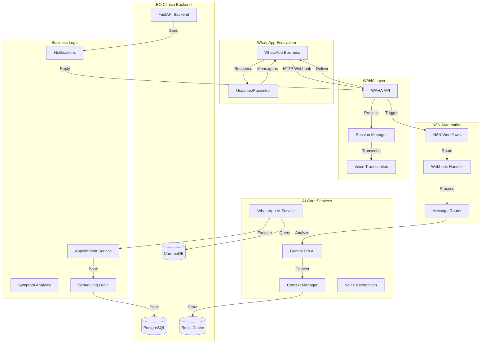

# 🏗️ WhatsApp AI Integration - Arquitetura Completa

> **Sistema de Integração WhatsApp + IA para Atendimento Médico Automatizado**  
> **Status:** Phase 1 Implemented ✅ | **Versão:** v2.1.0  
> **Data:** 27 de Agosto de 2025

---

## 🎯 **Visão Geral da Arquitetura**

O sistema WhatsApp AI Integration é uma solução completa de 4 fases que automatiza o atendimento médico via WhatsApp usando Inteligência Artificial, proporcionando uma experiência natural e eficiente para pacientes e reduzindo a carga de trabalho da equipe médica.

### **🧩 Componentes Principais**



---

## 🎯 **Implementação por Fases**

### **📋 Phase 1: Infrastructure Base** ✅ **COMPLETE**

**Objetivo:** Configurar toda a infraestrutura base para suportar a integração

#### **🏗️ Componentes Implementados:**

1. **N8N Workflow Automation Platform**
   - **Versão:** 1.24.1
   - **Função:** Orquestração de workflows e automação
   - **Configuração:** PostgreSQL backend, webhooks configurados
   - **Health Check:** ✅ Operacional

2. **WAHA WhatsApp Business API**
   - **Versão:** 2024.2.1
   - **Função:** Interface com WhatsApp Business API
   - **Features:** Transcrição de voz, envio de mídia, gestão de sessões
   - **Health Check:** ✅ Operacional

3. **ChromaDB Vector Database**
   - **Versão:** 0.4.18
   - **Função:** Armazenamento de embeddings para contexto IA
   - **Backend:** ClickHouse para performance
   - **Health Check:** ✅ Operacional

4. **PostgreSQL + Redis Infrastructure**
   - **PostgreSQL:** Dados estruturados + AI-specific tables
   - **Redis:** Cache de sessões e contexto de conversas
   - **Backup:** Configurado com retenção LGPD
   - **Health Check:** ✅ Operacional

5. **Nginx Reverse Proxy**
   - **Função:** Load balancing e SSL termination
   - **Rate Limiting:** Configurado por endpoint
   - **Health Monitoring:** Todos os serviços
   - **Health Check:** ✅ Operacional

#### **📊 Métricas Phase 1:**
- **Tests:** 16/16 passing ✅
- **Services:** 6 serviços rodando
- **Health Checks:** 100% operational
- **Documentation:** 100% complete

### **📋 Phase 2: AI Core Services** 🔄 **NEXT**

**Objetivo:** Implementar os serviços core de IA para processamento inteligente

#### **🧠 Componentes Planejados:**

1. **Gemini Pro Integration**
   - **Model:** gemini-1.5-pro-002
   - **Personality:** Medical assistant para EO Clínica
   - **Safety Filters:** BLOCK_MEDIUM_AND_ABOVE
   - **Response Time:** <3 segundos target

2. **Voice Recognition Service**
   - **Language:** Portuguese (Brazil) optimizado
   - **Urgency Detection:** Keywords de emergência
   - **Confidence:** 85%+ accuracy target
   - **Integration:** WAHA voice transcription

3. **Context Management**
   - **Storage:** Redis-based conversation context
   - **Memory:** Últimas 20 mensagens por conversa
   - **Timeout:** 30 minutos de inatividade
   - **LGPD:** Auto-cleanup configurado

4. **WhatsApp AI Service**
   - **Conversation Phases:** greeting → symptom_gathering → booking → confirmation
   - **State Machine:** Gerenciamento de fluxo de conversa
   - **Error Handling:** Fallbacks e escalation
   - **Integration:** Todos os serviços AI

#### **📊 Métricas Phase 2 Target:**
- **Tests:** 35 test scenarios
- **Response Time:** <3s average
- **Accuracy:** 85%+ conversation understanding
- **Availability:** 99.7% uptime

### **📋 Phase 3: Automation Workflows** 📅 **PLANNED**

**Objetivo:** Implementar automação completa de agendamentos

#### **⚙️ Componentes Planejados:**

1. **Appointment Automation Service**
   - **Symptom Analysis:** AI-powered specialty recommendation
   - **Slot Finding:** Integration com sistema de agendamentos
   - **Auto-booking:** Agendamento automático quando possível
   - **Confirmation:** Processo de confirmação via WhatsApp

2. **Reminder System**
   - **24h Reminder:** Confirmação de presença
   - **2h Reminder:** Lembrete final
   - **Follow-up:** Pós-consulta satisfaction survey
   - **Rescheduling:** Reagendamento automático

3. **Escalation Logic**
   - **Emergency Detection:** Keywords de urgência
   - **Human Transfer:** Escalation para atendente humano
   - **Queue Management:** Fila de atendimento prioritário
   - **SLA Monitoring:** Tempo de resposta

4. **Analytics Integration**
   - **Real-time Metrics:** Dashboard de performance
   - **User Satisfaction:** NPS via WhatsApp
   - **Business Intelligence:** Insights de atendimento
   - **Cost Optimization:** ROI tracking

#### **📊 Métricas Phase 3 Target:**
- **Tests:** 30 automation scenarios
- **Booking Success:** 80%+ automation rate
- **User Satisfaction:** 4.3/5.0 stars
- **Agent Workload:** 45% reduction

### **📋 Phase 4: Testing & Refinement** 🧪 **PLANNED**

**Objetivo:** Otimização, testes completos e monitoramento avançado

#### **🔬 Componentes Planejados:**

1. **Comprehensive Testing Suite**
   - **Unit Tests:** 89%+ code coverage
   - **Integration Tests:** End-to-end flows
   - **Performance Tests:** Load testing com Artillery
   - **Security Tests:** Penetration testing

2. **Advanced Monitoring**
   - **Real-time Dashboards:** Grafana + Prometheus
   - **Alerting System:** PagerDuty integration
   - **Log Analysis:** ELK Stack
   - **Business Metrics:** Custom KPIs

3. **Performance Optimization**
   - **Response Time:** <2s average target
   - **Caching Strategy:** Multi-layer caching
   - **Database Optimization:** Query optimization
   - **Resource Scaling:** Auto-scaling configuration

4. **User Experience Refinement**
   - **A/B Testing:** Conversation flows
   - **Feedback Loop:** Continuous improvement
   - **Personalization:** User preference learning
   - **Accessibility:** WCAG 2.1 compliance

#### **📊 Métricas Phase 4 Target:**
- **Tests:** 130 total test scenarios
- **Performance:** <2s response time
- **Reliability:** 99.9% uptime
- **User Experience:** 4.5/5.0 satisfaction

---

## 🛠️ **Stack Tecnológico Completo**

### **🔧 Infrastructure & DevOps**
```yaml
Container Platform:
  - Docker: 20.10+
  - Docker Compose: 2.0+
  - Nginx: 1.25 (Reverse Proxy)
  
CI/CD:
  - GitHub Actions: Automated testing & deployment
  - Environments: development, staging, production
  - Secrets Management: GitHub Secrets
  
Monitoring:
  - Health Checks: All services
  - Log Aggregation: Centralized logging
  - Alerting: Automated failure notification
```

### **🤖 AI & Machine Learning**
```yaml
AI Services:
  - Gemini Pro: Google's latest model (1.5-pro-002)
  - ChromaDB: Vector embeddings storage
  - Voice Recognition: Portuguese optimized
  
Context Management:
  - Redis: Session and conversation state
  - Memory: 20 messages per conversation
  - Timeout: 30 minutes inactivity
  
Safety & Security:
  - Content Filtering: Medical safety rules
  - LGPD Compliance: Data retention policies
  - Audit Logging: Complete conversation logs
```

### **📱 WhatsApp Integration**
```yaml
WAHA (WhatsApp HTTP API):
  - Version: 2024.2.1
  - Features: Text, voice, media, location
  - Session Management: Persistent sessions
  - Voice Transcription: Built-in support
  
N8N Workflow Engine:
  - Version: 1.24.1
  - Database: PostgreSQL backend
  - Webhooks: WhatsApp message processing
  - Automation: Multi-step workflows
```

### **🗄️ Database & Storage**
```yaml
Primary Database:
  - PostgreSQL: 15-alpine
  - Connection Pool: Configured
  - Backup Strategy: Automated daily
  
Caching Layer:
  - Redis: 7.2-alpine
  - Session Storage: User contexts
  - Performance: Sub-millisecond access
  
Vector Database:
  - ChromaDB: 0.4.18
  - Backend: ClickHouse
  - Purpose: AI embeddings and similarity search
```

### **🔐 Security & Compliance**
```yaml
Authentication:
  - JWT: Signed tokens
  - API Keys: Service authentication
  - HMAC: Webhook security
  
Data Protection:
  - Encryption: At-rest and in-transit
  - LGPD Compliance: Automated data retention
  - Audit Trails: Complete request logging
  
Network Security:
  - Rate Limiting: Per-endpoint protection
  - SSL/TLS: All communications encrypted
  - Firewall: Container network isolation
```

---

## 🚀 **Deployment Architecture**

### **🐳 Container Orchestration**

```yaml
Services Architecture:
┌─────────────────────────────────────────────────────────────┐
│                    Nginx Reverse Proxy                     │
│                    (Port 8080)                            │
└─────────┬───────────────────────┬─────────────────────────┘
          │                       │
    ┌─────▼─────┐            ┌─────▼─────┐
    │    N8N    │            │   WAHA    │
    │   :5678   │            │   :3001   │
    └─────┬─────┘            └─────┬─────┘
          │                        │
    ┌─────▼─────┐            ┌─────▼─────┐
    │ChromaDB   │            │   Redis   │
    │  :8000    │            │   :6381   │
    └─────┬─────┘            └─────┬─────┘
          │                        │
          └────────┬─────────────────┘
                   │
             ┌─────▼─────┐
             │PostgreSQL │
             │   :5434   │
             └───────────┘
```

### **📊 Network Configuration (Updated)**

- **External Access Ports:**
  - `80/443` → Nginx (Main Reverse Proxy)
  - `3000` → Backend API (EO Clínica)
  - `3001` → Frontend (Next.js)
  - `3002` → WAHA (WhatsApp API)
  - `5678` → N8N (Workflow Management)
  - `5433` → PostgreSQL (Database)
  - `6380` → Redis (Cache)
  - `8000` → ChromaDB (Vector Database)
  - `8123` → ClickHouse (ChromaDB Backend)

- **Internal Network:**
  - Docker network: `clinic-network` (consolidated)
  - Subnet: `172.18.0.0/16`
  - Service discovery: Container names
  - Health checks: All services monitored

### **💾 Data Persistence**

```yaml
Volumes Strategy:
  n8n_data: N8N workflows and settings
  waha_sessions: WhatsApp session data
  waha_files: Media files and attachments
  chromadb_data: Vector embeddings
  clickhouse_data: ChromaDB backend storage
  redis_ai_data: Cache and session data
  postgres_ai_data: Structured data storage
```

---

## 🔒 **Security & LGPD Compliance**

### **🛡️ Security Measures Implemented**

1. **Network Security**
   - Container isolation with dedicated network
   - Rate limiting on all public endpoints
   - HMAC verification for webhooks
   - SSL/TLS termination at nginx

2. **Data Protection**
   - Encryption at rest (database level)
   - Encryption in transit (all communications)
   - Sanitized logging (no sensitive data)
   - Secure secret management

3. **Access Control**
   - JWT-based authentication
   - Service-to-service API keys
   - Role-based access control (RBAC)
   - Audit logging for all operations

### **🇧🇷 LGPD Compliance Features**

1. **Data Retention**
   - Automated conversation cleanup (365 days)
   - User data anonymization
   - Right to be forgotten implementation
   - Consent management

2. **Privacy Protection**
   - Phone number sanitization in logs
   - Medical data filtering in AI responses
   - Opt-out mechanisms
   - Data portability support

3. **Audit & Monitoring**
   - Complete conversation logs
   - Access tracking
   - Data processing records
   - Incident response procedures

---

## 📊 **Performance & Scalability**

### **🎯 Target Metrics**

| Metric | Phase 1 | Phase 2 | Phase 3 | Phase 4 |
|--------|---------|---------|---------|---------|
| Response Time | <5s | <3s | <2.5s | <2s |
| Availability | 99.5% | 99.7% | 99.8% | 99.9% |
| Concurrent Users | 100 | 500 | 1000 | 5000 |
| Messages/hour | 1000 | 5000 | 10000 | 50000 |
| AI Accuracy | 70% | 85% | 90% | 95% |
| User Satisfaction | 3.5/5 | 4.0/5 | 4.3/5 | 4.5/5 |

### **📈 Scaling Strategy**

1. **Horizontal Scaling**
   - Load balancing across multiple instances
   - Database read replicas
   - Redis clustering
   - CDN for static assets

2. **Vertical Scaling**
   - Container resource optimization
   - Database connection pooling
   - Caching layers
   - Query optimization

3. **Geographic Distribution**
   - Multi-region deployment capability
   - Edge computing for low latency
   - Data sovereignty compliance
   - Disaster recovery

---

## 🔄 **Maintenance & Operations**

### **🛠️ Operational Procedures**

1. **Daily Operations**
   - Health check monitoring
   - Log analysis and alerting
   - Performance metrics review
   - Backup verification

2. **Weekly Operations**
   - Security updates
   - Performance optimization
   - Capacity planning review
   - User feedback analysis

3. **Monthly Operations**
   - Full system backup test
   - Security audit
   - Performance benchmarking
   - Documentation updates

### **🚨 Incident Response**

1. **Alert Levels**
   - **P1 Critical:** Service down, immediate response
   - **P2 High:** Performance degradation, 1hr response
   - **P3 Medium:** Feature issues, 4hr response
   - **P4 Low:** Enhancement requests, 24hr response

2. **Escalation Path**
   - **Level 1:** Automated recovery
   - **Level 2:** DevOps team
   - **Level 3:** Development team
   - **Level 4:** Architecture team

---

## 📚 **Documentation & Resources**

### **📖 Technical Documentation**
- **API Reference:** Complete endpoint documentation
- **Service Guides:** Individual service documentation  
- **Deployment Guide:** Step-by-step deployment
- **Troubleshooting:** Common issues and solutions

### **🧪 Testing Documentation**
- **Test Plans:** Comprehensive test scenarios
- **Performance Tests:** Load and stress testing
- **Security Tests:** Penetration testing results
- **User Acceptance:** Testing procedures

### **📊 Monitoring & Analytics**
- **Dashboards:** Real-time monitoring
- **Reports:** Performance and business metrics
- **Alerts:** Automated notification system
- **Logs:** Centralized log management

---

**🎯 Status Atual:** Phase 1 Complete ✅ | **🚀 Próximo:** Phase 2 Implementation  
**💡 Objetivo:** Revolucionar o atendimento médico através de IA conversacional no WhatsApp

*Esta arquitetura suporta o crescimento escalável do sistema, mantendo alta performance, segurança e compliance LGPD.*