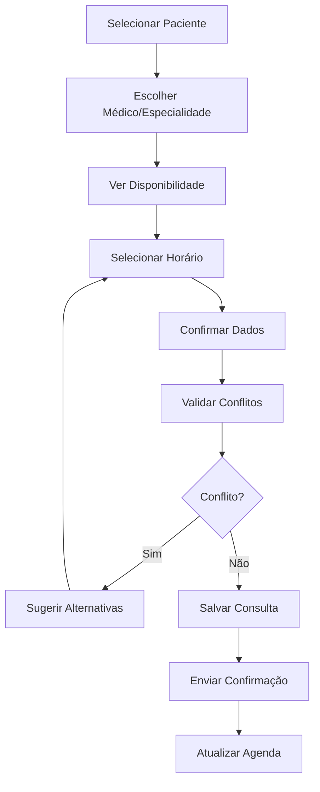
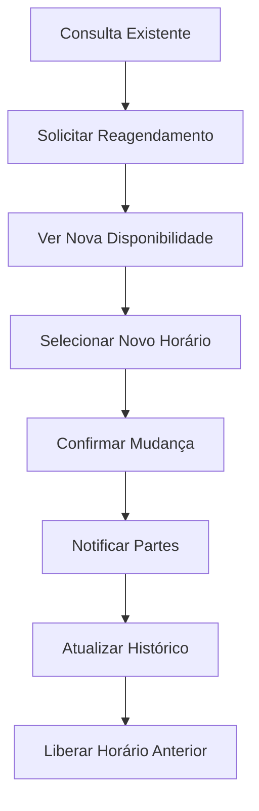

# EO Clínica - Preparação para Módulo de Consultas

## 🎯 Roadmap de Desenvolvimento do Sistema de Consultas

Documento de preparação técnica para o próximo módulo: **Sistema de Gestão de Consultas Médicas**, baseado nas lições aprendidas e padrões estabelecidos no módulo de pacientes.

**Data de Preparação**: 14 de agosto de 2025  
**Versão Planejada**: 1.2.0  
**Status**: 📋 Em Planejamento

---

## 🏗️ Fundação Sólida Estabelecida

### **✅ Padrões Definidos no Módulo de Pacientes**

#### **1. Validação de Dados**
- ✅ Algoritmos de validação robustos (CPF brasileiro)
- ✅ Verificação de duplicatas em tempo real
- ✅ Formatação automática durante digitação
- ✅ Debounce otimizado (500ms) para evitar spam de requests
- ✅ Mensagens contextuais e informativas

#### **2. Interface e UX**
- ✅ Design responsivo mobile-first
- ✅ Contraste adequado e acessibilidade
- ✅ Feedback visual imediato
- ✅ Estados de loading e erro bem definidos
- ✅ Navegação intuitiva com breadcrumbs

#### **3. Exportação e Relatórios**
- ✅ Sistema de exportação CSV/PDF funcional
- ✅ Encoding UTF-8 com BOM para Excel
- ✅ Relatórios profissionais sem elementos visuais desnecessários
- ✅ Métricas baseadas em dados reais do sistema
- ✅ Interface de impressão otimizada

#### **4. Persistência de Dados**
- ✅ Relacionamentos de banco bem definidos (User ↔ Patient)
- ✅ Transações atômicas para atualizações complexas
- ✅ Soft delete para preservação de histórico
- ✅ Auditoria completa de alterações

---

## 🔮 Visão do Módulo de Consultas

### **Objetivos Principais**
1. **Agendamento Inteligente**: Sistema de marcação com validações de conflito
2. **Gestão de Agenda**: Interface para médicos gerenciarem disponibilidade
3. **Acompanhamento**: Status de consultas em tempo real
4. **Integração**: Conexão natural com pacientes e médicos
5. **Relatórios**: Analytics específicos de consultas e performance

### **Funcionalidades Planejadas**
- 📅 **Calendário Interativo**: Visualização por dia/semana/mês
- 🕐 **Slots de Horários**: Configuração flexível por médico/especialidade
- 🔄 **Reagendamento**: Processo simplificado com notificações
- 📱 **Notificações**: SMS/Email/Push para lembretes
- 💰 **Faturamento**: Integração com valores das especialidades
- 📊 **Dashboard**: Métricas de ocupação e performance

---

## 🛠️ Componentes Reutilizáveis

### **Do Módulo de Pacientes Para Consultas**

#### **1. Validações (`cpf-validation.ts`)**
```typescript
// Pode ser expandido para outras validações
export const validateCRM = (crm: string): boolean => { /* ... */ }
export const validatePhone = (phone: string): boolean => { /* ... */ }
export const validateEmail = (email: string): boolean => { /* ... */ }
```

#### **2. Sistema de Exportação**
```typescript
// Pattern reutilizável para qualquer entidade
interface ExportableEntity {
  id: string
  [key: string]: any
}

export const generateEntityCSV = <T extends ExportableEntity>(
  entities: T[],
  headers: string[],
  filename: string
): void => { /* ... */ }
```

#### **3. Componentes de UI**
```tsx
// Formulários padronizados
<FormField 
  label="Campo"
  validation={validateField}
  debounceMs={500}
  required
/>

// Tabelas com filtros
<DataTable 
  data={consultations}
  columns={columns}
  filters={['status', 'doctor', 'specialty']}
  exportable
/>
```

#### **4. Hooks Personalizados**
```typescript
// Para validação em tempo real
export const useRealTimeValidation = (validator, debounceMs = 500)

// Para exportação de dados
export const useDataExport = (entityType: string)

// Para filtros de tabela
export const useTableFilters = (data: any[], filters: FilterConfig[])
```

---

## 📋 Esquema de Banco para Consultas

### **Novas Tabelas Necessárias**

#### **1. appointments (Já Existe - Precisa Expansão)**
```sql
ALTER TABLE appointments ADD COLUMN IF NOT EXISTS:
  - consultation_notes TEXT
  - prescription JSONB
  - follow_up_date TIMESTAMP
  - payment_status ENUM('PENDING', 'PAID', 'CANCELLED')
  - payment_amount DECIMAL(10,2)
  - payment_method ENUM('CASH', 'CARD', 'PIX', 'INSURANCE')
```

#### **2. doctor_availability (Nova)**
```sql
CREATE TABLE doctor_availability (
  id CUID PRIMARY KEY,
  doctor_id CUID REFERENCES users(id),
  day_of_week INTEGER, -- 0-6 (Sunday-Saturday)
  start_time TIME,
  end_time TIME,
  slot_duration INTEGER DEFAULT 30, -- minutes
  is_available BOOLEAN DEFAULT true,
  created_at TIMESTAMP DEFAULT NOW(),
  updated_at TIMESTAMP DEFAULT NOW()
);
```

#### **3. appointment_history (Nova)**
```sql
CREATE TABLE appointment_history (
  id CUID PRIMARY KEY,
  appointment_id CUID REFERENCES appointments(id),
  previous_status TEXT,
  new_status TEXT,
  changed_by CUID REFERENCES users(id),
  change_reason TEXT,
  created_at TIMESTAMP DEFAULT NOW()
);
```

### **Relacionamentos Chave**
```
Users (Doctor) ↔ Doctor_Availability (1:N)
Users (Patient) ↔ Appointments (1:N)  
Users (Doctor) ↔ Appointments (1:N)
Specialties ↔ Appointments (1:N)
Appointments ↔ Appointment_History (1:N)
```

---

## 🔧 API Endpoints Planejados

### **Gestão de Consultas**
```typescript
// Listar consultas com filtros avançados
GET /api/v1/appointments?doctor={id}&status={status}&date={date}

// Criar nova consulta
POST /api/v1/appointments
Body: {
  patientId: string,
  doctorId: string, 
  specialtyId: string,
  scheduledAt: string,
  duration: number,
  notes?: string
}

// Reagendar consulta
PATCH /api/v1/appointments/:id/reschedule
Body: { 
  newDate: string, 
  reason: string 
}

// Cancelar consulta
PATCH /api/v1/appointments/:id/cancel
Body: { 
  reason: string,
  refund?: boolean 
}
```

### **Disponibilidade de Médicos**
```typescript
// Obter slots disponíveis
GET /api/v1/doctors/:id/availability?date={date}&duration={minutes}

// Configurar disponibilidade
POST /api/v1/doctors/:id/availability
Body: {
  dayOfWeek: number,
  startTime: string,
  endTime: string,
  slotDuration: number
}

// Bloquear horário específico
POST /api/v1/doctors/:id/block-time
Body: {
  date: string,
  startTime: string,
  endTime: string,
  reason: string
}
```

### **Relatórios de Consultas**
```typescript
// Dashboard de consultas
GET /api/v1/appointments/analytics?period={period}&doctor={id}

// Exportar relatório
GET /api/v1/appointments/export?format={csv|pdf}&filters={}
```

---

## 🎨 Mockups de Interface

### **Páginas Principais**

#### **1. Calendário de Consultas (`/appointments`)**
```tsx
<AppLayout>
  <CalendarHeader>
    <ViewSelector options={['day', 'week', 'month']} />
    <DateNavigator />
    <QuickActions>
      <Button>Nova Consulta</Button>
      <Button>Exportar</Button>
    </QuickActions>
  </CalendarHeader>
  
  <CalendarGrid>
    {timeSlots.map(slot => (
      <TimeSlot 
        key={slot.time}
        appointments={slot.appointments}
        available={slot.available}
        onClick={handleSlotClick}
      />
    ))}
  </CalendarGrid>
  
  <AppointmentDetails 
    appointment={selectedAppointment}
    onUpdate={handleUpdate}
    onCancel={handleCancel}
  />
</AppLayout>
```

#### **2. Nova Consulta (`/appointments/new`)**
```tsx
<AppLayout>
  <FormSteps currentStep={step}>
    <Step1_PatientSelection />
    <Step2_DoctorSpecialty />  
    <Step3_DateTimeSelection />
    <Step4_Confirmation />
  </FormSteps>
  
  <FormActions>
    <Button variant="outline" onClick={handleBack}>
      Voltar
    </Button>
    <Button onClick={handleNext}>
      {isLastStep ? 'Confirmar' : 'Próximo'}
    </Button>
  </FormActions>
</AppLayout>
```

#### **3. Gestão de Agenda Médica (`/schedule/doctor`)**
```tsx
<AppLayout>
  <ScheduleHeader>
    <DoctorSelector />
    <WeekNavigator />
  </ScheduleHeader>
  
  <AvailabilityGrid>
    {weekDays.map(day => (
      <DayColumn key={day.date}>
        <DayHeader date={day.date} />
        <TimeSlots 
          slots={day.slots}
          onSlotClick={handleSlotConfig}
        />
      </DayColumn>
    ))}
  </AvailabilityGrid>
  
  <ConfigModal 
    isOpen={showConfig}
    slot={selectedSlot}
    onSave={handleSaveConfig}
  />
</AppLayout>
```

---

## 🔄 Fluxos de Trabalho

### **1. Agendamento de Consulta**


### **2. Reagendamento**


---

## 🧪 Estratégia de Testes

### **Cenários Críticos Para Testar**

#### **1. Conflitos de Agendamento**
```typescript
describe('Appointment Conflicts', () => {
  test('should prevent double booking same doctor', async () => {
    // Agendar consulta às 10:00
    // Tentar agendar outra às 10:00 com mesmo médico
    // Deve retornar erro de conflito
  })
  
  test('should allow consecutive appointments', async () => {
    // Agendar 10:00-10:30
    // Agendar 10:30-11:00
    // Deve permitir
  })
})
```

#### **2. Validações de Horário**
```typescript
describe('Time Validation', () => {
  test('should reject appointments in the past', async () => {
    // Tentar agendar data anterior a hoje
    // Deve retornar erro
  })
  
  test('should respect doctor availability', async () => {
    // Médico disponível só das 9h-17h
    // Tentar agendar às 18h
    // Deve retornar erro
  })
})
```

#### **3. Capacidade do Sistema**
```typescript
describe('Performance Tests', () => {
  test('should handle 100+ concurrent bookings', async () => {
    // Simular múltiplas tentativas simultâneas
    // Verificar integridade dos dados
  })
})
```

---

## 📊 Métricas e KPIs

### **Dashboard de Consultas**
- **Taxa de Ocupação**: % de slots preenchidos por médico
- **No-Show Rate**: % de faltas por período
- **Tempo Médio de Consulta**: Duração real vs planejada
- **Revenue per Appointment**: Receita média por consulta
- **Patient Satisfaction**: Avaliação pós-consulta
- **Doctor Efficiency**: Consultas por hora/dia

### **Alertas e Notificações**
- 🔴 **Crítico**: Overbooking detectado
- 🟡 **Atenção**: Taxa de no-show > 15%
- 🟢 **Sucesso**: Meta mensal atingida
- 📱 **Lembretes**: 24h, 2h antes da consulta

---

## 🚀 Cronograma de Desenvolvimento

### **Fase 1: Infraestrutura (1-2 semanas)**
- [ ] Criar tabelas de banco adicionais
- [ ] Implementar APIs básicas de CRUD
- [ ] Configurar validações de negócio
- [ ] Testes unitários das APIs

### **Fase 2: Interface Básica (2-3 semanas)**
- [ ] Calendário interativo  
- [ ] Formulário de nova consulta
- [ ] Lista de consultas com filtros
- [ ] Estados de loading e erro

### **Fase 3: Funcionalidades Avançadas (2-3 semanas)**
- [ ] Reagendamento inteligente
- [ ] Disponibilidade configurável
- [ ] Notificações em tempo real
- [ ] Exportação e relatórios

### **Fase 4: Integração e Polimento (1-2 semanas)**
- [ ] Integração com módulo de pacientes
- [ ] Testes de integração
- [ ] Performance optimization
- [ ] Documentação final

---

## 🔗 Pontos de Integração

### **Com Módulo de Pacientes**
- Validação de CPF reutilizada para médicos
- Sistema de exportação expandido
- Padrões de UI/UX mantidos
- Logs e auditoria consistentes

### **Com Sistema de Especialidades**  
- Preços automáticos baseados na especialidade
- Duração padrão por tipo de consulta
- Filtros por especialidade

### **Com Sistema de Usuários**
- Roles e permissões (Doctor, Patient, Admin)
- Autenticação unificada
- Auditoria de ações

---

## 🛡️ Considerações de Segurança

### **Dados Sensíveis**
- **Prescrições**: Criptografia AES-256
- **Notas Médicas**: Acesso restrito por role
- **Dados Financeiros**: Auditoria completa
- **LGPD**: Logs de acesso e modificação

### **Validações Críticas**
- Médico só pode ver suas próprias consultas
- Paciente só acessa seus dados
- Admin tem visão completa mas auditada
- Backup automático antes de alterações críticas

---

## 📚 Documentação Necessária

### **Para Desenvolvedores**
- [ ] API Documentation (Swagger)
- [ ] Database Schema Updates
- [ ] Component Library Extensions
- [ ] Testing Strategy Guide

### **Para Usuários**
- [ ] Manual de Agendamento
- [ ] Guia de Configuração (Médicos)
- [ ] Troubleshooting de Consultas
- [ ] FAQ de Funcionalidades

---

## 🎯 Critérios de Sucesso

### **Funcionalidades Obrigatórias**
- ✅ Agendamento sem conflitos
- ✅ Reagendamento fácil e intuitivo  
- ✅ Calendário responsivo e rápido
- ✅ Notificações automáticas funcionando
- ✅ Exportação de relatórios
- ✅ Integração com dados existentes

### **Performance**
- ⚡ Carregamento do calendário < 2s
- ⚡ Validação de conflitos < 500ms
- ⚡ Suporte a 1000+ consultas simultâneas
- ⚡ Interface responsiva em todos dispositivos

### **UX/UI**
- 🎨 Interface intuitiva (teste com usuários reais)
- 🎨 Feedback visual para todas as ações
- 🎨 Acessibilidade WCAG 2.1 AA
- 🎨 Modo offline básico para consulta

---

**EO Clínica - Consultation Module Preparation**  
**Status**: 📋 Documentação Completa  
**Próximo Passo**: 🚀 Iniciar Fase 1 - Infraestrutura  
**Fundação**: ✅ Padrões sólidos do módulo de pacientes  
**Estimativa**: 6-10 semanas para conclusão completa  

*Documento preparado em: 14 de agosto de 2025*