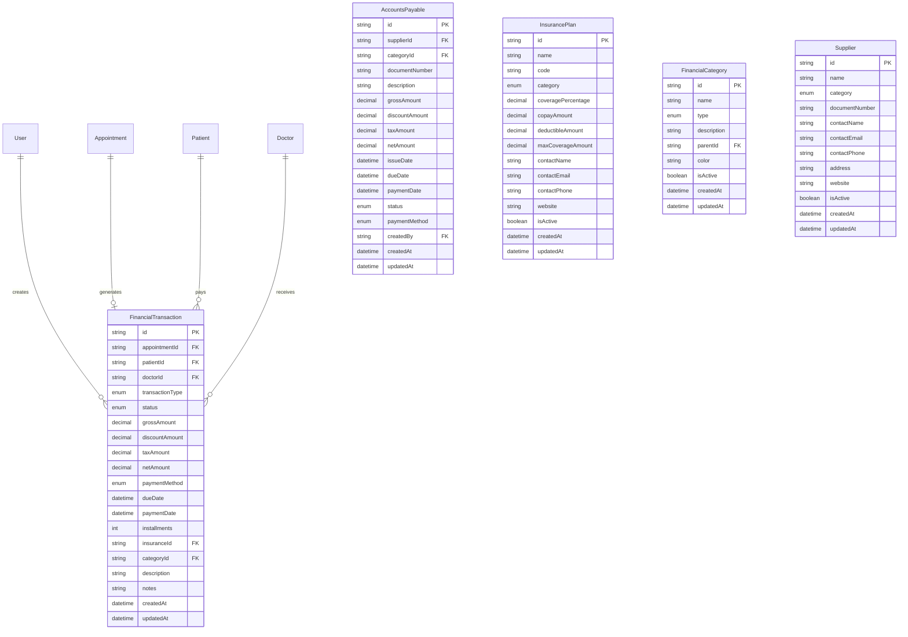

# 💰 Módulo Financeiro - EO Clínica

## 📋 Visão Geral

O módulo financeiro do EO Clínica é um sistema completo de gestão financeira integrado ao sistema de consultas médicas, oferecendo controle total sobre receitas, despesas, contas a pagar/receber, convênios e relatórios financeiros.

## 🏗️ Arquitetura do Sistema

### Database Schema



## 🔐 Sistema de Autenticação e Permissões

### Roles Financeiros
- **ADMIN**: Acesso completo a todas as funcionalidades
- **FINANCIAL_MANAGER**: Gestão financeira completa, exceto configurações
- **DOCTOR**: Visualização das próprias transações
- **RECEPTIONIST**: Visualização limitada
- **PATIENT**: Visualização dos próprios pagamentos

### Matriz de Permissões

| Operação | ADMIN | FINANCIAL_MANAGER | DOCTOR | RECEPTIONIST | PATIENT |
|----------|-------|-------------------|---------|--------------|---------|
| Dashboard | ✅ | ✅ | 📊 | ❌ | ❌ |
| Ver Transações | ✅ | ✅ | 👤 | 📋 | 👤 |
| Criar Transações | ✅ | ✅ | ❌ | ❌ | ❌ |
| Editar Transações | ✅ | ✅ | ❌ | ❌ | ❌ |
| Deletar Transações | ✅ | ❌ | ❌ | ❌ | ❌ |
| Contas a Pagar | ✅ | ✅ | ❌ | ❌ | ❌ |
| Aprovar Pagamentos | ✅ | ✅ | ❌ | ❌ | ❌ |
| Relatórios | ✅ | ✅ | 👤 | ❌ | 👤 |
| Configurações | ✅ | ❌ | ❌ | ❌ | ❌ |

**Legenda**: ✅ = Acesso total | 👤 = Apenas próprios dados | 📊 = Dados limitados | 📋 = Visualização básica | ❌ = Sem acesso

## 🛠️ Estrutura de Arquivos

```
src/
├── database/
│   ├── schema.prisma                 # Schema com modelos financeiros
│   └── migrations/                   # Migrações do banco
├── types/
│   └── financial.ts                  # Types TypeScript
├── services/
│   └── financial.service.ts          # Lógica de negócios
├── middleware/
│   └── financial-auth.middleware.ts  # Autenticação e permissões
└── routes/
    └── financial/
        ├── index.ts                  # Rota principal
        ├── dashboard.ts              # Dashboard e KPIs
        ├── transactions.ts           # Transações financeiras
        ├── receivables.ts            # Contas a receber
        ├── payables.ts              # Contas a pagar
        ├── insurance.ts             # Planos de convênio
        ├── suppliers.ts             # Fornecedores
        ├── categories.ts            # Categorias
        └── reports.ts               # Relatórios
```

## 🚀 Endpoints da API

### Base URL: `/api/v1/financial`

#### 🏥 Health Check
- **GET** `/health` - Status do módulo financeiro (público)

#### 📊 Dashboard
- **GET** `/dashboard` - KPIs e métricas em tempo real
- **GET** `/dashboard/kpi/:metric` - Métrica específica com histórico

#### 💳 Transações Financeiras
- **GET** `/transactions` - Listar transações com filtros
- **GET** `/transactions/:id` - Detalhes de uma transação
- **POST** `/transactions` - Criar nova transação
- **PUT** `/transactions/:id` - Atualizar transação
- **DELETE** `/transactions/:id` - Cancelar transação

#### 📥 Contas a Receber
- **GET** `/receivables` - Listar contas a receber
- **GET** `/receivables/overdue` - Contas em atraso
- **GET** `/receivables/by-patient` - Agrupado por paciente
- **GET** `/receivables/aging-analysis` - Análise de aging
- **POST** `/receivables/:id/mark-paid` - Marcar como pago

#### 📤 Contas a Pagar
- **GET** `/payables` - Listar contas a pagar
- **GET** `/payables/:id` - Detalhes de uma conta
- **POST** `/payables` - Criar nova conta a pagar
- **PUT** `/payables/:id` - Atualizar conta
- **POST** `/payables/:id/approve` - Aprovar pagamento
- **DELETE** `/payables/:id` - Cancelar/desativar
- **GET** `/payables/overdue/list` - Contas em atraso
- **GET** `/payables/upcoming/list` - Próximos vencimentos

#### 🏥 Planos de Convênio
- **GET** `/insurance` - Listar planos de convênio
- **GET** `/insurance/:id` - Detalhes de um plano
- **POST** `/insurance` - Criar novo plano
- **PUT** `/insurance/:id` - Atualizar plano
- **DELETE** `/insurance/:id` - Desativar plano
- **GET** `/insurance/categories/summary` - Resumo por categoria
- **POST** `/insurance/:id/calculate-coverage` - Calcular cobertura

#### 🏢 Fornecedores
- **GET** `/suppliers` - Listar fornecedores
- **GET** `/suppliers/:id` - Detalhes de um fornecedor
- **POST** `/suppliers` - Criar novo fornecedor
- **PUT** `/suppliers/:id` - Atualizar fornecedor
- **DELETE** `/suppliers/:id` - Desativar fornecedor
- **GET** `/suppliers/categories/summary` - Resumo por categoria
- **GET** `/suppliers/top-suppliers` - Top fornecedores por volume

#### 📁 Categorias Financeiras
- **GET** `/categories` - Listar categorias
- **GET** `/categories/:id` - Detalhes de uma categoria
- **POST** `/categories` - Criar nova categoria
- **PUT** `/categories/:id` - Atualizar categoria
- **DELETE** `/categories/:id` - Desativar categoria
- **GET** `/categories/tree/structure` - Estrutura hierárquica

#### 📈 Relatórios
- **GET** `/reports/cash-flow` - Relatório de fluxo de caixa
- **GET** `/reports/profitability` - Análise de lucratividade
- **GET** `/reports/receivables-aging` - Aging de recebíveis
- **GET** `/reports/summary` - Resumo financeiro geral

## 📊 KPIs e Métricas

### Dashboard Principal
- **Receita Total**: Soma de todas as transações pagas
- **Despesas Totais**: Soma de todas as contas pagas
- **Lucro Líquido**: Receita - Despesas
- **Saldo em Caixa**: Fluxo de caixa acumulado
- **Taxa de Crescimento**: Comparação mensal de receitas/despesas
- **Contas a Receber**: Valor pendente de recebimento
- **Contas a Pagar**: Valor pendente de pagamento

### Métricas Avançadas
- **Aging Analysis**: Classificação por tempo de atraso
- **Taxa de Conversão**: % de consultas pagas
- **Ticket Médio**: Valor médio por consulta
- **Análise por Médico**: Performance individual
- **Análise por Especialidade**: Rentabilidade por área
- **Análise de Convênios**: Performance dos planos

## 🔍 Funcionalidades Principais

### 1. Gestão de Transações
- Registro automático de receitas das consultas
- Controle de pagamentos (dinheiro, cartão, PIX, convênio)
- Parcelamento e controle de vencimentos
- Integração com planos de convênio
- Descontos e taxas configuráveis

### 2. Contas a Pagar
- Cadastro de fornecedores por categoria
- Workflow de aprovação de pagamentos
- Controle de vencimentos e alertas
- Integração com categorias de despesas
- Relatórios de pagamentos

### 3. Controle de Recebíveis
- Análise de aging (30, 60, 90+ dias)
- Alertas de vencimento
- Cobrança automatizada
- Renegociação de débitos
- Relatórios de inadimplência

### 4. Planos de Convênio
- Cadastro de planos com regras específicas
- Cálculo automático de cobertura
- Controle de co-participação e franquia
- Limites de cobertura
- Autorização de procedimentos

### 5. Relatórios Financeiros
- **Cash Flow**: Fluxo de caixa detalhado
- **DRE**: Demonstração de Resultados
- **Aging Report**: Análise de recebíveis
- **Performance por Médico**: Rentabilidade individual
- **Análise de Convênios**: Comparativo de planos

## 💡 Recursos Técnicos

### Validações e Segurança
- Validação de valores monetários
- Controle de permissões por endpoint
- Filtragem automática por usuário
- Audit logs de todas as operações
- Prevenção de operações duplicadas

### Performance
- Queries otimizadas com Prisma
- Agregações nativas do PostgreSQL
- Índices otimizados para consultas financeiras
- Cache de KPIs para dashboard
- Paginação em todas as listagens

### Integrações
- Sistema de usuários e permissões
- Integração com agendamento de consultas
- Conexão com perfis de pacientes/médicos
- Sistema de especialidades médicas
- Logs de auditoria centralizados

## 🚦 Status de Implementação

### ✅ Fase 1 - Foundation (100% Concluída)
- [x] Database schema e migrations
- [x] Types TypeScript completos
- [x] Serviços de negócio
- [x] Middleware de autenticação
- [x] API routes completas
- [x] Documentação técnica

### ✅ Fase 2 - Dashboard & Frontend (100% Concluída)
- [x] Dashboard financeiro (`/financial`)
- [x] Componentes React reutilizáveis
- [x] Navegação no sidebar
- [x] KPIs em tempo real
- [x] Interface responsiva
- [x] Integração frontend-backend

### ✅ Fase 3 - Payables & Suppliers (100% Concluída)
- [x] Página de contas a pagar
- [x] Página de fornecedores
- [x] Workflow de aprovação
- [x] Notificações de vencimento

### ⏳ Próximas Fases
- [ ] **Fase 4**: Relatórios Avançados & Integrações
- [ ] **Fase 5**: Otimizações & Features Extras

## 🧪 Testes e Validação

### Endpoint de Teste
```bash
# Health check (público)
curl http://localhost:3000/api/v1/financial/health

# Dashboard (requer autenticação)
curl -H "Authorization: Bearer <token>" \
     http://localhost:3000/api/v1/financial/dashboard
```

### Dados de Teste
O sistema utiliza **dados reais do banco PostgreSQL**. Não há dados fictícios ou mock - todas as consultas são executadas diretamente no banco de dados.

## 📝 Notas Importantes

1. **Sem Dados Fictícios**: Conforme solicitado, todo o sistema utiliza conexões reais com PostgreSQL
2. **Autenticação Requerida**: Todos os endpoints (exceto health) requerem autenticação válida
3. **Permissões Granulares**: Sistema robusto de controle de acesso
4. **Audit Trail**: Todas as operações são registradas para auditoria
5. **Escalabilidade**: Arquitetura preparada para grande volume de transações

## 🔗 Links Relacionados

- [Checklist de Implementação](./FINANCIAL_MODULE_CHECKLIST.md)
- [Documentação da API](./API_DOCUMENTATION.md)
- [Schema do Banco](./DATABASE_SCHEMA.md)
- [Arquitetura do Sistema](./ARCHITECTURE.md)