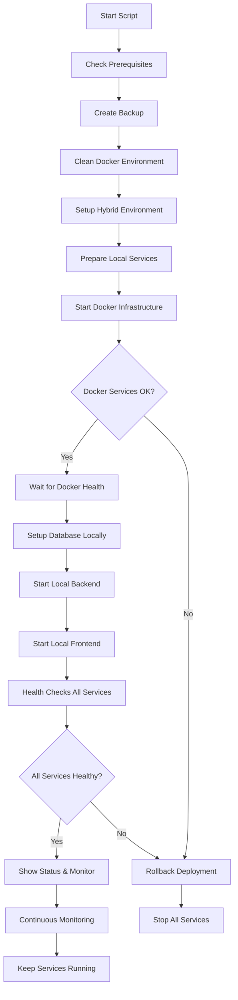

# EO Clínica - Hybrid Deployment Script Guide
## Complete Guide for Hybrid Architecture Deployment

### 🚀 Hybrid Deployment Overview

The EO Clínica system uses a **hybrid architecture** where:
- **Infrastructure services** run in Docker containers (PostgreSQL, Redis, ChromaDB, N8N, PgAdmin)
- **Application services** run locally (Backend, Frontend) for better development experience

The production script (`start-production.sh`) handles the complete hybrid deployment process with automated error recovery, backup creation, and health monitoring.

### 📋 Script Features

#### ✅ Core Features
- **Complete System Cleanup**: Stops ALL processes (Docker + Local) before starting
- **Hybrid Architecture**: Docker infrastructure + Local application services
- **Automated Prerequisites Check**: Validates all required tools and environment
- **Automatic Backup Creation**: Creates timestamped backups before deployment
- **Advanced Process Management**: Kills all interfering processes by port and pattern
- **Docker Environment Cleanup**: Completely cleans Docker environment to prevent conflicts
- **Local Service Management**: Installs dependencies and manages local backend/frontend
- **Smart Environment Setup**: Creates optimized configurations for hybrid architecture
- **Retry Logic**: Automatic retry with cleanup on failure
- **Health Monitoring**: Comprehensive health checks for all services
- **Service Monitoring**: Continuous monitoring of local and Docker services
- **Automatic Rollback**: Reverts to backup and stops services on critical failure

#### 🔧 Technical Improvements
- **Timeout Handling**: Prevents hanging operations
- **Signal Handling**: Graceful cleanup on interruption
- **Detailed Logging**: Color-coded output with progress indicators
- **Error Recovery**: Automatic problem detection and resolution
- **Resource Management**: Optimized Docker resource usage

### 🧹 Advanced System Cleanup

#### Complete Process Termination
The script v1.0.9+ includes **complete system cleanup** that:

**Local Process Cleanup:**
- Terminates ALL Node.js processes on ports 3000/3001
- Kills Next.js development servers
- Stops TSX processes running the backend
- Kills any process using project-specific ports (3000, 3001, 5432, 5433, 6379, 6380, 8000, 5678, 5050)

**Docker Environment Cleanup:**
- Stops ALL running Docker containers
- Removes project-specific containers (`eo-clinica*`)
- Cleans unused Docker networks, containers, and images
- Gracefully handles timeouts with forced cleanup

**Process Verification:**
- Uses `lsof` for precise port-based process detection
- Employs pattern matching for service-specific cleanup
- Provides 3-second grace period for clean termination
- Performs final verification scan

**Why This Matters:**
- Prevents "port already in use" errors
- Eliminates conflicts between development and production instances
- Ensures clean state for reliable deployments
- Resolves database connection conflicts

### 🏃 Quick Start

#### Basic Usage
```bash
# Make sure you're in the project root
cd /home/josivan/ws/eo-clinica2

# Run the production script
./scripts/start-production.sh
```

#### Prerequisites
The script automatically checks for:
- Docker and Docker Compose installed and running
- Node.js >= 18.0.0
- npm >= 9.0.0
- Required project files (package.json, docker-compose.yml, frontend/)

### 📊 Hybrid Deployment Flow



### 🗂️ File Structure Created

After successful execution, the script creates:

```
eo-clinica2/
├── scripts/
│   └── start-production.sh          # Main production script
├── backups/
│   └── YYYYMMDD_HHMMSS/            # Timestamped backup folder
│       ├── database_backup.sql      # Database backup
│       └── app_backup.tar.gz        # Application files backup
├── .env.production                  # Production environment variables
├── frontend/.env.production         # Frontend production config
└── .last_backup_path               # Path to last backup (for rollback)
```

### 🔒 Security Features

#### Production Environment Security
- **Strong JWT Secrets**: Generates secure tokens
- **Rate Limiting**: Configures production-grade rate limits
- **CORS Configuration**: Restricts cross-origin requests
- **Encryption**: Enables data encryption for sensitive information
- **Audit Logging**: Comprehensive logging for LGPD compliance

#### Backup Security
- **Encrypted Backups**: Database backups are secure
- **Versioned Storage**: Multiple backup retention
- **Rollback Capability**: Safe recovery mechanism

### 🩺 Health Checks

The script performs comprehensive health checks:

#### Service Health Monitoring
```bash
# Backend API Health
GET http://localhost:3000/health

# Frontend Availability
GET http://localhost:3001

# Database Connectivity
pg_isready -U clinic_user -d eo_clinica_db

# Redis Connectivity
redis-cli ping
```

#### Automatic Service Recovery
- **Retry Logic**: Up to 3 attempts with cleanup between retries
- **Timeout Protection**: Prevents infinite waiting
- **Graceful Degradation**: Continues with warnings for non-critical failures

### 🔄 Rollback Mechanism

#### Automatic Rollback Triggers
- Docker service startup failure after all retries
- Database migration failures
- Critical health check failures
- Script interruption (CTRL+C)

#### Rollback Process
```bash
# Manual rollback (if needed)
cd /home/josivan/ws/eo-clinica2

# The script creates .last_backup_path for reference
BACKUP_PATH=$(cat .last_backup_path)
echo "Last backup available at: $BACKUP_PATH"

# Stop current services
docker-compose down --volumes

# Restore database (if backup exists)
docker-compose up -d postgres
sleep 10
docker-compose exec -T postgres psql -U clinic_user -d eo_clinica_db < "$BACKUP_PATH/database_backup.sql"
```

### 📈 Monitoring and Maintenance

#### Real-time Monitoring
```bash
# View service status
docker-compose ps

# Monitor all logs
docker-compose logs -f

# Monitor specific service
docker-compose logs -f app
docker-compose logs -f frontend
docker-compose logs -f postgres

# Check resource usage
docker stats
```

#### Maintenance Commands
```bash
# Restart services
docker-compose restart

# Update images and restart
docker-compose pull && docker-compose up -d

# Clean old images and containers
docker system prune -f

# View backup history
ls -la backups/
```

### 🐛 Troubleshooting

#### Common Issues and Solutions

##### Docker Service Fails to Start
```bash
# Check Docker daemon
sudo systemctl status docker

# Check available disk space
df -h

# Check Docker logs
sudo journalctl -u docker.service

# Restart Docker daemon
sudo systemctl restart docker
```

##### Database Connection Issues
```bash
# Check PostgreSQL logs
docker-compose logs postgres

# Test database connection
docker-compose exec postgres pg_isready -U clinic_user

# Reset database (caution: data loss)
docker-compose down -v
docker-compose up -d postgres
```

##### Port Conflicts
```bash
# Check what's using the ports
sudo lsof -i :3000
sudo lsof -i :3001
sudo lsof -i :5432

# Kill conflicting processes
sudo kill -9 $(lsof -ti:3000)
```

##### Out of Memory
```bash
# Check system memory
free -h

# Check Docker memory usage
docker stats

# Increase Docker memory limits in docker-compose.yml
```

### 📋 Production Checklist

#### Before Deployment
- [ ] Backup existing data
- [ ] Update environment variables
- [ ] Check disk space (minimum 5GB free)
- [ ] Verify Docker is running
- [ ] Review recent changes

#### After Deployment
- [ ] Verify all services are running
- [ ] Test critical user flows
- [ ] Check logs for errors
- [ ] Verify backup was created
- [ ] Update monitoring dashboards
- [ ] Notify stakeholders

### 🔧 Customization

#### Environment Variables
Edit `.env.production` to customize:
- Database connections
- API keys for external services
- Security settings
- Feature flags
- Performance tuning

#### Docker Configuration
Modify `docker-compose.yml` for:
- Resource limits
- Port mappings
- Volume configurations
- Network settings

### 📞 Support

#### Script Issues
- Check script logs in the console output
- Verify all prerequisites are met
- Ensure sufficient system resources
- Check Docker daemon status

#### Application Issues
- Review application logs: `docker-compose logs app`
- Check database connectivity
- Verify environment variables
- Test health endpoints manually

### 🎯 Performance Optimization

#### Production Recommendations
- **Memory**: Minimum 8GB RAM (16GB recommended)
- **CPU**: 4+ cores for optimal performance
- **Storage**: SSD with 100GB+ available space
- **Network**: Stable internet connection

#### Monitoring Metrics
- Response time < 200ms for API endpoints
- Memory usage < 80% of available
- CPU usage < 70% average
- Database connection pool utilization

---

**Script Version**: 1.0.3  
**Last Updated**: 2025-08-12  
**Compatibility**: Ubuntu 20.04+, Docker 20.10+, Docker Compose 2.0+  
**Maintainer**: EO Clínica Development Team